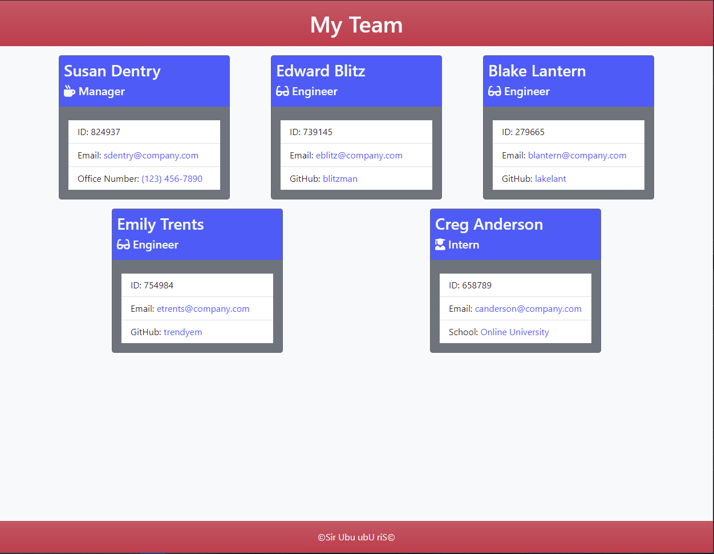

# Team Profile Generator
## Description
Using the terminal, enter information about your team to generate a styled html page. This page will allow you to see all of your team members, their role (Manger, Engineer, or Intern) and click on their information such as emails, office numbers, GitHub links, etc. Save or deploy your rendered page for you and your team to use!

## Table of Contents
* [Usage](#usage)
* [Questions](#questions)

      
* [Installation](#installation)
        
* [Credits](#credits)
        
* [License](#license)
                
* [Contributing](#contributing)
        
* [Tests](#tests)
        
    
  

## Installation
This is a `node` application. Node must be installed in order to run this application. See [Credits](#credits) for information on installing `node`.    This is a terminal prompt application. You must use the terminal to evoke and run this application.    Follow these steps to install this application:    1. Clone the repository to your local machine.   2. In the terminal, navigate to the repository main directory and run `npm install` to install the required dependencies (see [Credits](#credits))    You now have everything installed to run this application. See [Usage](#usage) on instruction on how to use this application.    See this walk-through video for full installation steps: [Application Walk-Through](https://)
    
## Usage
This is a `node` application. Node must be installed in order to run this application. See * [Credits](#credits) for information on installing `node`.    This is a terminal prompt application. You must use the terminal to evoke and run this application.    Follow these steps to use this application:    1. In the terminal and repository main directory evoke `node index.js`   2. You will be met with a prompt to enter information about your team manager.   3. Once you finish entering the manager information, you will be met with a menu to select to either:   - *Add an Engineer* to add information for an engineer,   - *Add an Intern* to add information for an intern,   - *Finish Team* to exit the prompts and generate the HTML and CSS page.   4. Until you select *Finish Team*, you will continue to return to the menu to select to add another team member or finish the team.   5. Once you select *Finish Team*, the console will alert you that the HTML file was generated using the provided information and the CSS file was copied. These will be available in the `dist/` directory.   If there was an error, the console will alert you to it.

### Screenshot

    
### Link
See this link for a walk-through of the usage of this application: [Usage Walk-Through](https://)

## Credits
**RESOURCES**   [node.js](https://nodejs.org/en/)   [Inquirer.js](https://www.npmjs.com/package/inquirer)   [Jest.js](https://jestjs.io/)
    

## License

    

## Contributing
This project is not oped to external contribution.

## Tests
This application uses `jest.js` to run the tests suites (see [Credits](#credits) for more info on `jest.js`)    Once you have installed the applicaiton (see [Installation](#installation)), you can envoke the test suites through the terminal.    There are four test suites:    1. Employee.test   2. Engineer.test   3. Intern.test   4. Manager.test    Each test is designed to ensure that the respective object is created with the appropriate properties and methods returning expected data.    To run the tests, in the terminal envoke `npm test`. To envoke a specific test suite, envoke `npm run test (name)` where (name) is the suite (Employee, Engineer, Intern, or Manager).    See this link for a walk-through of the tests of this application: [Tests Walk-Through](https://)
    
## Questions
For all questions regarding this project, feel free to contact me at:

GitHub: [SirUbu](https://github.com/SirUbu)

Email: thesirubu@gmail.com
